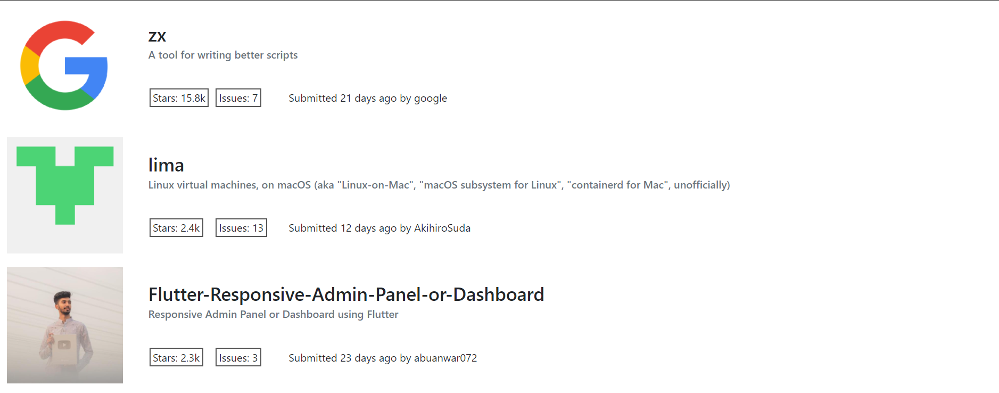

# Front-end Coding Challenge

This application shows the most starred repos on GitHub in the last 30 days with infinite scroll and a responsive design

## Run Locally

```bash
  git clone https://github.com/ahmedhassan202025/Gemography-Code-Challenge.git
  cd Gemography-Code-Challenge
  yarn
  yarn start
```

## Screenshots



## Deployment

This project is deployed at [vercel.com](https://codestars.vercel.app/home)
